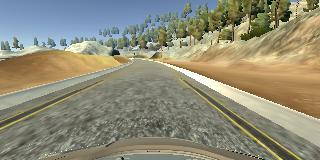
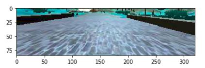
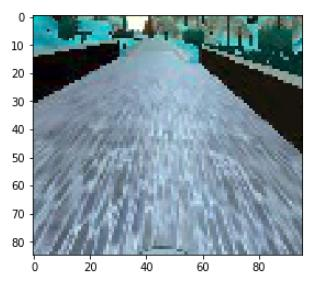
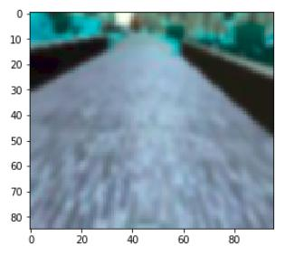
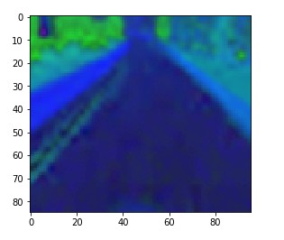
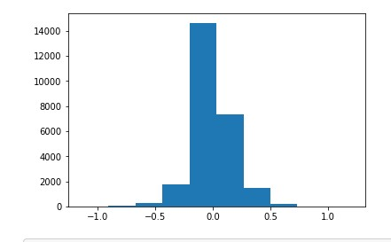
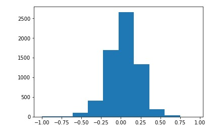
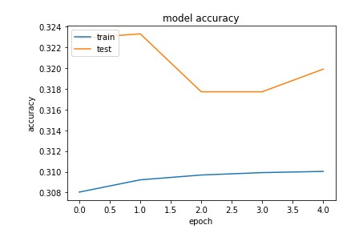
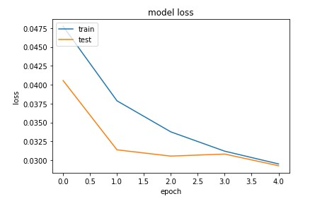

# **Behavioural Cloning**

The goals / steps of this project are the following:

* Use the simulator to collect data of good driving behaviour
* Build, a convolution neural network in Keras that predicts steering angles from images
* Train and validate the model with a training and validation set
* Test that the model successfully drives around track one without leaving the road
* Summarise the results with a written report

[train.ipynb]: https://github.com/sandeeppatil/CarND-Behavioral-Cloning-P3/blob/master/train.ipynb
[model_lenet.h5]: https://github.com/sandeeppatil/CarND-Behavioral-Cloning-P3/blob/master/model_lenet.h5
[weights_lenet.h5]: https://github.com/sandeeppatil/CarND-Behavioral-Cloning-P3/blob/master/weights_lenet.h5
[drive.py]: https://github.com/sandeeppatil/CarND-Behavioral-Cloning-P3/blob/master/drive.py
[video.mp4]: https://github.com/sandeeppatil/CarND-Behavioral-Cloning-P3/blob/master/video.mp4
[video.py]: https://github.com/sandeeppatil/CarND-Behavioral-Cloning-P3/blob/master/video.py
[data.zip]: https://d17h27t6h515a5.cloudfront.net/topher/2016/December/584f6edd_data/data.zip
[linux_sim]: https://d17h27t6h515a5.cloudfront.net/topher/2017/February/58ae46bb_linux-sim/linux-sim.zip
[win_sim]: https://d17h27t6h515a5.cloudfront.net/topher/2017/February/58ae4419_windows-sim/windows-sim.zip
[LeNet]: http://yann.lecun.com/exdb/publis/pdf/lecun-01a.pdf
[Nvidia]: https://images.nvidia.com/content/tegra/automotive/images/2016/solutions/pdf/end-to-end-dl-using-px.pdf

## Files Submitted

Project include following files

* [train.ipynb] -> containing the script to create and train the model
* [model_lenet.h5] -> containing a trained model
* [weights_lenet.h5] -> containing a intermediate trained model
* [drive.py] -> for driving the car in autonomous mode
* [video.mp4] -> video recorded by running car autonomously using [model_lenet.h5]
* [video.py] -> for converting sequence of images into .mp4 video

## Testing Model

Using the Udacity provided simulator and my [drive.py] file, the car can be driven autonomously around the track by executing

```sh
python drive.py model_lenet.h5
```

## Model Architecture

### 1. Choosing Model

The [LeNet] Architecture is used to build the Convolution Neural Network with an input data normalised using keras lambda layer

### 2. Reduce Over-fitting in the Model

The Model contains l2 regularizer and dropout layers to reduce Over-fitting

### 3. Training & Validation Data Size

* Training Samples:  25712 from [data.zip] + 836 self generated using [linux_sim]
* Validation Samples:  6432 from [data.zip] + 212 self generated using [linux_sim]

Note: The above training data are combination of centre, left and right camera images generated by the simulator

### 4. Hyper-parameters

The following hyper parameters were used

* Epocs: **5**
* Optimizer: **Adam**
* Learning Rate: **0.01**
* Batch Size: **32**

## Training Strategy

### 1. Overall strategy

The overall strategy was to try at least 2 different well known models and compare. I choose [LeNet] and [Nvidia] model. [Nvidia] Model had more parameters than LeNet and I could achieve target with LeNet. This will not only reduce training time also uses less memory and runtime when deployed on hardware.

### 2. Final Model Architecture

|Layer (type)                  |Output Shape              |Param #   |
|------------------------------|:------------------------:|---------:|
|lambda_1 (Lambda)             |(None, 85, 96, 3)         |0         |
|conv2d_1 (Conv2D)             |(None, 81, 92, 6)         |456       |
|max_pooling2d_1 (MaxPooling2) |(None, 40, 46, 6)         |0         |
|conv2d_2 (Conv2D)             |(None, 36, 42, 16)        |2416      |
|max_pooling2d_2 (MaxPooling2) |(None, 18, 21, 16)        |0         |
|flatten_1 (Flatten)           |(None, 6048)              |0         |
|dense_1 (Dense)               |(None, 120)               |725880    |
|dropout_1 (Dropout)           |(None, 120)               |0         |
|dense_2 (Dense)               |(None, 84)                |10164     |
|dropout_2 (Dropout)           |(None, 84)                |0         |
|dense_3 (Dense)               |(None, 1)                 |85        |
|                              |                          |          |

* Total params: 739,001
* Trainable params: 739,001
* Non-trainable params: 0

### 3. Pre-processing of the Training/Validation Set

#### The original image shape: (160, 320, 3)



#### STEP1: Crop image to remove sky on top and car hood at the bottom, resulting image shape: (85, 320, 3)



#### STEP2: Resize the image to fasten the runtime without affecting the accuracy, resulting image shape: (85, 96, 3)



#### STEP3: Gaussian Blur the image to reduce noice and improve the accuracy: [Ref](https://arxiv.org/pdf/1604.04004.pdf)



#### STEP4: Change the color space from BGR to HSV to tackle shadows regions 



#### Similar Pre-process in Drive.py

Same pre-process pipeline is used in [drive.py] before feeding to the model for predection

### 4. Training Process

#### 1. Captruring Data

Pre-captured driving behaviour is used from [data.zip]. [linux_sim] was used to capture more data for the cases where car was failing to be on track.

The data captured has 3 camera angle views, all of them were used with stering angle correction of 0.2 degrees for the left and right camera views.

To tackle right turn bias, the center images are flipped and stering angles are reversed to generate more data.

Here is the histogram for distrubution of various steering angle recorded

##### **For Training Set**



##### **For Validation Set**



#### 2. Feeding Data to the Model

Loading thounds of image files at a time in RAM would crash the system. Hence, a generator function is used to generate batch of data just before feeding to the model.

#### 3. Saving Model

The Loss is continuesly monitored during training and the best epoch with the lowest validation loss is saved using callback function ([weights_lenet.h5]).

Model generated from final Epoch is also saved as [model_lenet.h5]. This is used to retrain the model (transfer learning) with extra data recorded for the failing cases.

Following are the sample accuracy and loss curve for training and validation data which was captured during training extra data to tackle failed case





## Final Test Run Video Rcording

Here is the final test run video recorded at this link: [video.mp4]